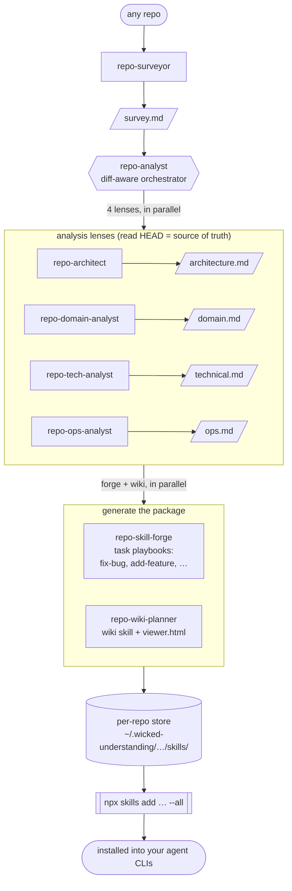

```
           _      __            __
 _      __(_)____/ /_____  ____/ /
| | /| / / / ___/ //_/ _ \/ __  /
| |/ |/ / / /__/ ,< /  __/ /_/ /
|__/|__/_/\___/_/|_|\___/\__,_/

                   __               __                  ___
  __  ______  ____/ /__  __________/ /_____ _____  ____/ (_)___  ____ _
 / / / / __ \/ __  / _ \/ ___/ ___/ __/ __ `/ __ \/ __  / / __ \/ __ `/
/ /_/ / / / / /_/ /  __/ /  (__  ) /_/ /_/ / / / / /_/ / / / / / /_/ /
\__,_/_/ /_/\__,_/\___/_/  /____/\__/\__,_/_/ /_/\__,_/_/_/ /_/\__, /
                                                              /____/
```

**Your agent already remembers *what* your repo is. It still re-figures-out *how
to change it* every single task.** wicked-understanding hands it the how — this
repo's real playbooks for fixing a bug, adding a feature, or writing a test (the
exact files, the wiring step, the command, the gotcha that bites) — so it spends
the turn doing the work instead of rediscovering the method from scratch.

```bash
npx skills add mikeparcewski/wicked-understanding --all
```

Works with **Claude Code**, **Gemini CLI**, **Cursor**, **Codex**, and **Copilot
CLI** — anything the [`skills`](https://agentskills.io) standard targets. Dogfooded
on four real repos: Python, Node, a large TypeScript monorepo, and Go.

---

## The problem

Memory and context tools have gotten good at telling your agent *what* your repo
is. None of them tell it *how to work in it*. So every task starts the same way:
the agent greps around, opens files, and re-derives the method — which file owns
this kind of bug, what the add-a-feature sequence is, where the new code gets
wired in, which command actually runs the tests, the one convention that breaks
everything if you miss it. It reconstructs all of that, sometimes wrong, **every
session, in every chat, across every CLI** — and throws it away when the session
ends.

That rediscovery is the slow, error-prone part. The agent burns its first chunk of
effort relearning *how* before it can touch the *what you asked for*.

## What you get instead

Analyze the repo **once** and give the agent the how. Focused lenses read the code
at HEAD and turn it into repo-specific playbooks the agent loads on demand:

- **The how — task playbooks.** `fix-bug`, `add-feature`, `add-domain`,
  `write-tests`, `scaffold`, each written for *this* repo: symptom→file triage,
  the exact step order, the real wiring point ("register it here or it won't
  boot"), the test command, the trap that causes the 404. The agent *follows* the
  method instead of guessing at it.
- **The why, on demand — a wiki.** An agent-loadable knowledge base + HTML viewer
  for the deeper context a playbook points to when a task needs it.
- **The router — a `CLAUDE.md` / `AGENTS.md` block.** ~50 always-loaded lines that
  send the agent to the right playbook for the task at hand. Merge-safe: it
  augments a managed block and never touches your hand-written rules.

It installs as skills via `npx skills` and runs in any CLI — self-contained: no
server, no vector DB, no lock-in. The lenses read HEAD, so the playbooks track the
code instead of rotting like hand-written docs; re-run after a change and only
what moved is refreshed.

> Already use memory or [wicked-brain](https://github.com/mikeparcewski)? Keep
> them — they cover the *what*. This is the *how*, and it complements them: point
> `repo-analyst --enrich-from-brain` at a running brain to fold in design
> rationale (ADRs, decisions) the code alone can't show. Additive only.

---

## Skills

| Skill | Role | Watches | Output |
|---|---|---|---|
| `repo-surveyor` | Mandatory first step | whole repo | `survey.md` + manifest |
| `repo-architect` | Lens | entry points, DI, interfaces, routers | `architecture.md` + manifest |
| `repo-domain-analyst` | Lens | models, services, schemas, validators | `domain.md` + manifest |
| `repo-tech-analyst` | Lens | source files, tests, lint config | `technical.md` + manifest |
| `repo-ops-analyst` | Lens | Dockerfile, CI, Makefile, .env | `ops.md` + manifest |
| `repo-analyst` | **Orchestrator** | manifests → re-runs stale lenses | refreshed artifacts |
| `repo-skill-forge` | Post-analysis | all artifacts | task-skill package |
| `repo-wiki-planner` | Post-analysis | all artifacts | wiki skill + viewer |
| `repo-orient` | Post-analysis (last) | artifacts + generated skills | merge-safe `CLAUDE.md`/`AGENTS.md` routing to them |

## Pipeline



## Analysis backend

The **lenses always run and are the source of truth** — they read HEAD, so the
analysis is accurate and current. wicked-brain is an **opt-in build-time
enricher** (`repo-analyst --enrich-from-brain`): when its server is reachable it
*adds* supplementary design rationale (ADRs, recorded decisions) the lenses can't
see, in a separate marked section — it never replaces a lens artifact or
overrides a lens fact. Brain is never a runtime dependency; the output is the
same self-contained, cross-CLI `npx skills` package either way.

An A/B against a live brain settled this: brain as a *substitute* source was
worse — it served a stale, since-deleted docs/ADR tree and missed the sharpest
gotchas the lenses caught — so the lenses stay the floor and brain stays additive.

## Typical workflows

| You say… | What runs |
|---|---|
| "analyze this repo" | surveyor → 4 lenses → asks which output(s) |
| "analyze and build the wiki and skills" | full pipeline → forge + wiki in parallel |
| "generate the wiki" / "build docs" | full pipeline → wiki only |
| "build the dev skills" | full pipeline → forge only |
| "refresh the analysis" / "what changed?" | freshness check → re-run only stale lenses |
| "show me the wiki" / "open the viewer" | regenerate `viewer.html` from current refs |

You can also invoke any skill directly — e.g. "run repo-architect on /path" —
as long as a survey exists.

## Progressive loading

Task skills carry only what's needed to *start* a task (triage tables,
implementation sequences, command cheatsheets — under ~120 lines). Each ends
with a "Load for deeper context" table pointing into `../wiki/refs/` (the wiki
skill installs alongside them), so the agent pulls deeper knowledge
(`arch.md`, `domain.md`, `api.md`, `onboard.md`, …) only when the step needs it.

## Diff awareness

Every lens writes a `*.manifest.json` sidecar recording the git commit, watch
patterns, and the files it actually read. `check_freshness.py` runs
`git diff {commit}..HEAD` filtered to each lens's watch patterns (falling back
to mtime when git is unavailable). Only stale or missing lenses re-run. The
wiki planner maps lens changes to article types and regenerates only the
affected articles.

## Architecture: agents vs. scripts

The pipeline draws a hard line between LLM work and deterministic mechanics:

- **LLM work is dispatched as subagents** by the orchestrator using the host's
  native parallel-agent mechanism (with a sequential fallback). This covers the
  4 lens analyses, the selected task-skill generations, and the N wiki-article
  generations. No `claude -p` subprocesses — the pipeline is host-agnostic and
  needs no CLI on PATH.
- **Deterministic mechanics stay as Python scripts** (no LLM judgment,
  token-free, repeatable):
  - `repo-analyst/scripts/init_understanding.py` — store keying + index
  - `repo-analyst/scripts/check_freshness.py` — git-diff / mtime freshness
  - `repo-wiki-planner/scripts/assemble_wiki_skill.py` — router templating
  - `repo-wiki-planner/scripts/generate_viewer.py` — standalone HTML viewer

Each script ships in its skill's `scripts/` directory and is invoked by path
relative to the installed skill (no `$CLAUDE_PLUGIN_ROOT` dependency). Python 3
stdlib only.

## Storage

```
~/.wicked-understanding/
├── index.json                       # all analyzed repos
└── repos/{repo-key}/                # keyed by git remote (or dir name)
    ├── meta.json
    ├── survey.md        + survey.manifest.json
    ├── architecture.md  + architecture.manifest.json
    ├── domain.md        + domain.manifest.json
    ├── technical.md     + technical.manifest.json
    ├── ops.md           + ops.manifest.json
    ├── skills/                       # generated package → npx skills add
    │   ├── fix-bug/ add-feature/ … (per the size-scaling rule)
    │   └── wiki/ (SKILL.md + refs/)
    └── viewer.html                   # regenerated on demand
```

Files use bare names because the directory is already per-repo. Generated
skills are staged under `skills/` and installed into your agent CLI(s) by the
pipeline (`npx skills add`), not written into the analyzed repo's tree.

## Wiki article types

| Article type | ref file | Generated when |
|---|---|---|
| `product-overview` | `overview.md` | always |
| `onboarding-maintainer` | `onboard.md` | always |
| `domain-reference` | `domain.md` | domain has ≥ 1 core entity |
| `architecture-overview` | `arch.md` | ≥ 2 components found |
| `api-reference` | `api.md` | API surface identified |
| `capability` (×1–5) | `cap-{feature}.md` | ≥ 3 operations in domain |
| `concept-explanation` (×1–5) | `concept-{term}.md` | ≥ 3 glossary terms |
| `design-pattern` | `patterns.md` | ≥ 2 recurring patterns |
| `runbook` (×1–3) | `ops.md` | multi-step ops procedures |
| `agent-roster` | `agents.md` | agentic repo detected |

Every article follows the wiki output contract (purpose-prefixed slugs,
canonical IDs, strict H2 anchor order, file-based `[src: …]` citations, a
5-rule lint self-check, and an Evidence / Open Questions / Confidence closer).
The `slug` is the article's wiki-system identity; the `ref_file` is the stable
on-disk name the wiki router and task skills load.
