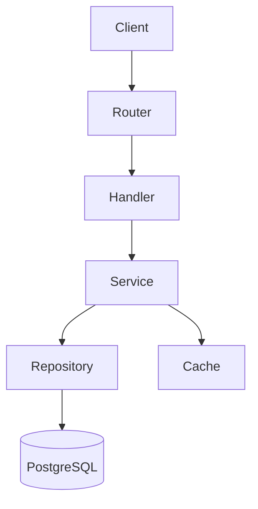

# Architecture Analysis Guide

Reference for `repo-architect`. Read before starting analysis.

---

## Detect the stack first (the categories below are illustrative)

The file categories, signals, and examples in this guide span ecosystems. They
are a menu, not a checklist. Before applying any of them, fix what this repo
actually is — from the survey:

- **Language(s)** and the idiomatic unit of structure (class, module, package, crate).
- **Paradigm**: OO vs functional vs procedural. Don't look for a DI container in
  a functional Rust crate or a Go service that wires with plain constructors.
- **Shape**: web service vs CLI vs library vs batch/job vs desktop. A library has
  no router; a CLI's "API surface" is its command tree, not HTTP routes.
- **Persistence**: has-DB vs no-DB. Many Go/Rust tools and most libraries have no
  database, no ORM, and no migrations — that is a finding, not a gap to fill.
- **Build tool**: this anchors where wiring and entry points live.

Describe what exists. Never assume a layer, DI container, ORM, migration tool, or
framework the repo does not have. If a section's signals don't appear, say so
plainly and move on — absence is data.

---

## File-Reading Strategy

### Bootstrap / entry point files

Read 50–80 lines. Look for:
- What gets instantiated at startup (servers, workers, schedulers)
- What is wired together (DI container setup, manual wiring)
- What configuration is loaded
- Order of initialization (reveals implicit dependencies)

### Component-wiring files (DI container, provider, registry, or `main`)

The densest file for architecture is wherever components get wired together.
The mechanism is stack-specific — find the one that applies:

- **DI container / module graph**: `container.register(...)` with lifetimes;
  `@Module({ imports, providers, controllers })` (NestJS); `bind(Interface).to(Impl)`;
  Spring `@Configuration`/`@Bean`; `provide`/`useFactory`.
- **Explicit constructor wiring (Go, idiomatic)**: `func main()` or a `New*`
  constructor chain in `cmd/` that builds dependencies by hand and passes them
  down. Google `wire` (`wire.Build(...)`, `//go:build wireinject`) or Uber `fx`/`dig`
  if the repo uses generated/runtime DI instead.
- **Module tree + trait objects (Rust)**: the crate's `main.rs`/`lib.rs` and
  `mod` declarations define the structure; wiring is constructing concrete types
  and passing `Box<dyn Trait>`/`Arc<dyn Trait>` or generic params. No container.
- **Module imports / composition (Python, functional)**: top-level module that
  imports and composes the pieces; factory functions; closures capturing
  collaborators rather than injected fields.
- **Middleware stacks**: `app.use(...)` chains and equivalents.

From whichever applies you can construct the component graph without reading every
file. If wiring is just `main` calling constructors, say that — explicit wiring is
a deliberate architecture, not a missing one.

### Abstraction-boundary files (interface, trait, protocol, abstract base)

These define the architectural seams — the boundaries between parts. Read them
all. They're usually short and extremely revealing. By stack: Go `interface`
types (often defined at the consumer); Rust `trait` definitions; TS/Java
`interface`; Python `Protocol`/ABC; or, in functional code, a module's exported
function signatures / a type alias for a function. If the language leans on
structural typing or plain functions and has few named interfaces, that itself
describes the boundary style.

Look for:
- What operations are defined (tells you what the part does)
- What types cross the boundary (tells you what data flows)
- What is NOT on the interface (tells you what's encapsulated)

### Entry-point registry (router, command tree, or public API)

Read to get a complete inventory of the surface. What "surface" means depends on
the shape:
- **Web service**: HTTP routes. Go `http.ServeMux`/chi/gin/echo route tables;
  Rust axum/actix-web `Router`/route macros; Express/NestJS/FastAPI/Flask
  decorators. Note route structure (nested vs flat), versioning.
- **CLI**: the command/subcommand registry. Go cobra (`rootCmd.AddCommand`),
  `flag`; Rust clap (`#[derive(Parser)]`, `Subcommand`); Python click/argparse;
  oclif/commander. The command tree is the API surface.
- **Library**: the public exports — `pub` items in Rust, exported identifiers in
  Go (capitalized) / a curated `lib.rs`/`mod.rs`, `__all__`, package index. There
  is no router; document the public API instead.

Note handler/command naming conventions and middleware applied per-route vs globally.

### Middleware / filter chains

Read to understand cross-cutting concerns. Note:
- Execution order (crucial — auth before validation before business logic)
- What each middleware reads and writes to the request context
- Error-handling middleware (usually last in chain)

---

## Recognizing Architectural Styles

Directory names below are illustrative (TS/Java conventions). Map to this repo's
idioms: Go groups by package under `internal/`/`pkg/` (e.g. `internal/store`,
`internal/api`); Rust by `mod`/crate (a Cargo workspace's member crates are the
boundaries); functional codebases by module/file rather than class folders. A
style is present when the *dependency structure* matches, regardless of folder
names. Many small CLIs and libraries fit none of these cleanly — "flat, no
enforced layering" is a valid finding; don't force-fit a style.

### Layered / N-Tier
**Signals**: `controllers/`, `services/`, `repositories/`/`dao/` at the same level
— or the language equivalent (Go: `handler`→`service`→`store` packages; Rust:
`api`→`domain`→`repo` modules).
**Data flow**: handler → service → repository → DB. Simple, predictable.
**Check**: does a lower layer call back up into a higher one? (violation if yes)

### Hexagonal / Clean / Ports & Adapters
**Signals**: `domain/`/`core/` isolated from `infrastructure/`/`adapters/`. Ports
are interfaces/traits in the core; implementations live outside it. In Go, the
core package defines interfaces and imports no infra package; in Rust, the domain
crate defines traits and depends on no adapter crate.
**Data flow**: adapters → ports (interfaces/traits) → domain → ports → adapters.
**Check**: does the core import/depend on infrastructure? (violation if yes)

### CQRS
**Signals**: separate `commands/` and `queries/` directories, or `CommandBus`/`QueryBus`
(Go/Rust: distinct command vs query types/handlers, often two stores). Write side and
read side may use different models/stores.

### Event-Driven / Event Sourcing
**Signals**: `EventBus`, `EventEmitter`, `DomainEvent`, `EventStore`, `Projections`;
Go channels/goroutines or a message-broker client as the bus; Rust an event `enum` +
`mpsc`/broker. State changes trigger events; other components react asynchronously.

### Modular Monolith
**Signals**: `modules/`/`packages/` at top level, each self-contained (Go: sibling
packages under `internal/`; Rust: a Cargo workspace with member crates per module).
Clear boundaries, single process/binary.

### Microservices
**Signals**: multiple independently deployable services (a `services/` dir, multiple
`cmd/` mains in Go, multiple binary crates in Rust, or separate repos). Inter-service
communication via HTTP/gRPC/messaging.

---

## Dependency Direction Analysis

Good architectures have a clear dependency direction. Violations are red flags.

**How to check**: read import/dependency declarations in 5–10 representative files
(`import` in TS/Python/Go, `use`/`mod` in Rust, plus inter-package/inter-crate
deps — Go package imports, Cargo workspace member deps).
- Does domain/core import from infrastructure? → **Violation**
- Do lower layers import from higher layers? → **Violation**
- Are there circular imports (A imports B imports A)? → **Problem** (Go forbids
  circular *package* imports outright, so within Go this surfaces as a build
  error or an over-merged package; Rust forbids circular *crate* deps but allows
  module cycles).

**Note circular deps** even if they're not strictly architectural violations —
they make the codebase harder to test and reason about.

---

## Mapping Cross-Cutting Concerns

For each concern, find where it's implemented. Only applies if the shape has that
concern — a pure library or offline batch tool may have no auth/authz at all;
record that rather than hunting. Signals below are illustrative across stacks
(middleware/decorators in web frameworks; in Go often explicit
`http.Handler`-wrapping middleware or a call at the top of a handler; in Rust a
tower `Layer`/extractor or an explicit call; in CLIs a guard in the command body):

**Authentication**: `AuthMiddleware`, `@UseGuards(JwtAuthGuard)`, `@login_required`,
a token-verifying middleware wrapper, or an `authenticate()` call in the request path.

**Authorization**: `PermissionGuard`, `@Roles(...)`, `policy.check()`,
`can?(user, action, resource)`, or an explicit permission check. Distinguish from
authentication.

**Validation**: `@Body() @Validate(Dto)`, `Joi.validate()`, `pydantic.BaseModel`,
`z.parse()`, Go struct-tag validators or hand-written checks, Rust `serde` +
`validator`/manual guards. Note where validation happens in the flow.

**Error handling**: `ExceptionFilter`, `@app.errorhandler`, global `catch` blocks,
Go `error` returns checked at the boundary, Rust `Result<T, E>`/`?`. (Full
treatment is the tech lens — here just locate the central handling point.)

**Logging**: find the logger pattern — injected vs imported vs a package-level
logger (Go `log`/`slog`/zap, Rust `log`/`tracing`). Is it structured (JSON) or text?

---

## Producing the Component Diagram

The diagram below is a web-service example. Draw the components that actually
exist: a CLI diagram runs command → parser → handler → core → output; a library
diagram shows module/crate dependencies; a no-DB tool has no DB node. Don't add a
`[PostgreSQL]` node to a tool that writes files or calls an API.

Choose ASCII or Mermaid based on complexity:

**ASCII** (simpler, always renders):
```
[Client] → [Router: src/routes/] → [Handler: src/handlers/]
                                          │
                    ┌─────────────────────┘
                    ▼
             [Service: src/services/]
                    │
         ┌──────────┴──────────┐
         ▼                     ▼
  [Repo: src/repos/]    [Cache: src/cache/]
         │
         ▼
    [PostgreSQL]
```

**Mermaid** (better for complex systems):


Include 4–8 components. Don't include every file — just the major nodes.
